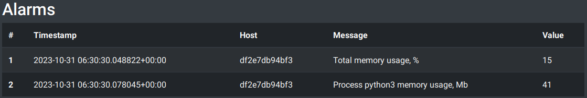

# memory_consupmtion_tool

Small memory consumption analyzer tool. Sends alarms to REST API on excessive memory usage.
And some testing environment.

## Quick start

* Deploy containers using
```shell 
docker compose up
```
* Go to http://localhost:8000/alarms/ to see something like this:




## Repo structure:

### `monitored` directory

Contains:

* `mem_cons_tool.py` - main tool module.

    Run `./mem_cons_tool.py -h` for available CLI args.

* `.env_settings`
    
    Contains tool settings as environment variables

* `mem_cons_tool` - helper package with submodules:
    * `alarmist.py` - API interactions
    * `config.py` - settings wrapper
    * `logger.py` - logging configuration
    * `memory_watcher.py` - gathers total and per process memory consumption data

* `Dockerfile` to build a monitored host container


### `fake_api` directory

A tiny FastAPI app for tests and demonstration.


### `docker-compose.yaml`

For demo purposes.
